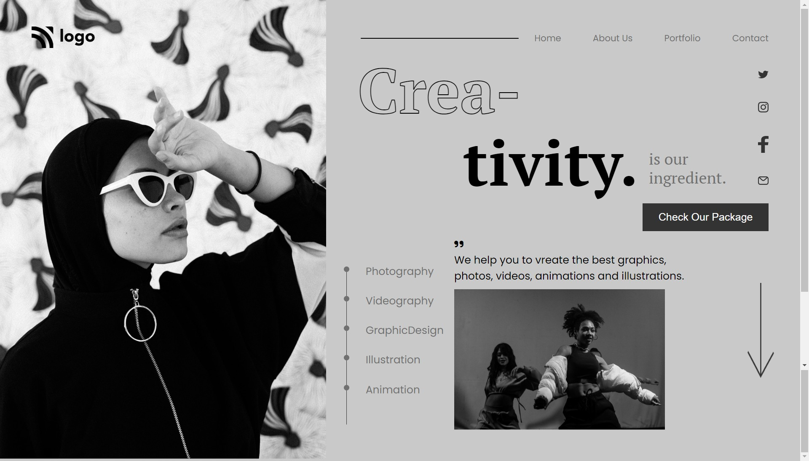
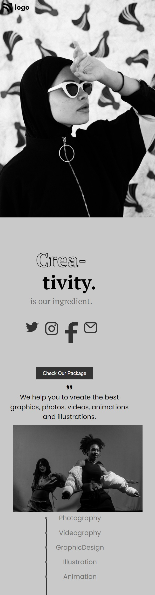

# Project-14 HTML & CSS Full Stack Javascript Web Development Course

## About

This project is created using HTML and CSS. I have used CSS Positioning and felx-box to build this project, and this project is responsive

## ⚙️ What did I learn by making this project?

-   learn about css -webkit-text-stroke property and used it in this project.

-   learn about ::marker and used it to design list-style.

-   learn CSS positioning.

## ⌛ Time taken to finish this project?

This project took me around 4 hour to finish.

## 📷 Screenshots

